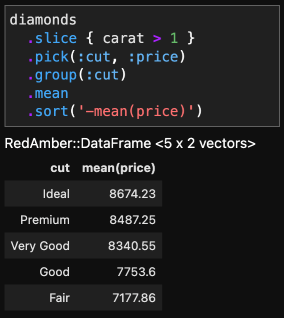
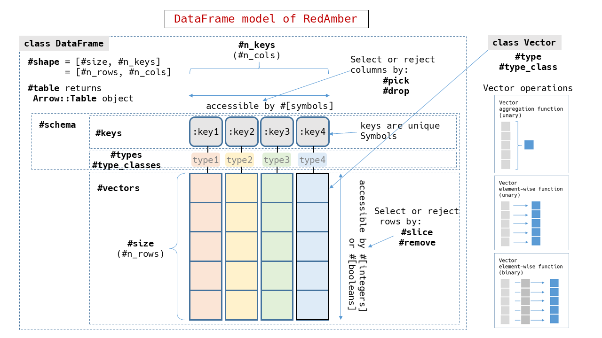

# RedAmber

[](https://badge.fury.io/rb/red_amber)
[](https://github.com/heronshoes/red_amber/actions/workflows/ci.yml)
[](https://github.com/heronshoes/red_amber/discussions)

A simple dataframe library for Ruby.

- Powered by [Red Arrow](https://github.com/apache/arrow/tree/master/ruby/red-arrow) [](https://gitter.im/red-data-tools/en)
- Inspired by the dataframe library [Rover-df](https://github.com/ankane/rover)



## Requirements

Supported Ruby version is >= 2.7.

Since v0.2.0, this library uses pattern matching which is an experimental feature in 2.7 . It is usable but a warning message will be shown in 2.7 .
I recommend Ruby 3 for performance.

```ruby
# Libraries required
gem 'red-arrow',   '~> 10.0.0' # Requires Apache Arrow (see installation below)

gem 'red-parquet', '~> 10.0.0' # Optional, if you use IO from/to parquet
gem 'rover-df',    '~> 0.3.0' # Optional, if you use IO from/to Rover::DataFrame
```

## Installation

Install requirements before you install Red Amber.

- Apache Arrow (~> 10.0.0)
- Apache Arrow GLib (~> 10.0.0)
- Apache Parquet GLib (~> 10.0.0)  # If you use IO from/to parquet

  See [Apache Arrow install document](https://arrow.apache.org/install/).
  
  - Minimum installation example for the latest Ubuntu:
    ```
    sudo apt update
    sudo apt install -y -V ca-certificates lsb-release wget
    wget https://apache.jfrog.io/artifactory/arrow/$(lsb_release --id --short | tr 'A-Z' 'a-z')/apache-arrow-apt-source-latest-$(lsb_release --codename --short).deb
    sudo apt install -y -V ./apache-arrow-apt-source-latest-$(lsb_release --codename --short).deb
    sudo apt update
    sudo apt install -y -V libarrow-dev
    sudo apt install -y -V libarrow-glib-dev
    ```
  - On macOS, you can install Apache Arrow C++ library using Homebrew:
    
    ```
    brew install apache-arrow
    ```

    and GLib (C) package with:

    ```
    brew install apache-arrow-glib
    ```

If you prepared Apache Arrow, add these lines to your Gemfile:

```ruby
gem 'red-arrow',   '~> 10.0.0'
gem 'red_amber'
gem 'red-parquet', '~> 10.0.0' # Optional, if you use IO from/to parquet
gem 'rover-df',    '~> 0.3.0'  # Optional, if you use IO from/to Rover::DataFrame
gem 'red-datasets-arrow'       # Optional, recommended if you use Red Datasets
gem 'red-arrow-numo-narray'    # Optional, recommended if you use inputs from Numo::NArray
```

And then execute `bundle install` or install it yourself as `gem install red_amber`.

## Docker image and Jupyter Notebook

[RubyData Docker Stacks](https://github.com/RubyData/docker-stacks) is available as a ready-to-run Docker image containing Jupyter and useful data tools as well as RedAmber (Thanks to @mrkn).

Also you can try the contents of this README interactively by [Binder](https://mybinder.org/v2/gh/heronshoes/docker-stacks/RedAmber-binder?filepath=red-amber.ipynb). 
[](https://mybinder.org/v2/gh/heronshoes/docker-stacks/RedAmber-binder?filepath=red-amber.ipynb)


## Data frame in `RedAmber`

Class `RedAmber::DataFrame` represents a set of data in 2D-shape.
The entity is a Red Arrow's Table object. 



Let's load the library and try some examples.

```ruby
require 'red_amber' # require 'red-amber' is also OK.
include RedAmber
```

### Example: diamonds dataset

```ruby
require 'datasets-arrow' # to load sample data

dataset = Datasets::Diamonds.new
diamonds = DataFrame.new(dataset) # from v0.2.2, should be `dataset.to_arrow` if older.

# =>
#<RedAmber::DataFrame : 53940 x 10 Vectors, 0x000000000000f668>
         carat cut       color    clarity     depth    table    price        x ...        z
      <double> <string>  <string> <string> <double> <double> <uint16> <double> ... <double>
    0     0.23 Ideal     E        SI2          61.5     55.0      326     3.95 ...     2.43
    1     0.21 Premium   E        SI1          59.8     61.0      326     3.89 ...     2.31
    2     0.23 Good      E        VS1          56.9     65.0      327     4.05 ...     2.31
    3     0.29 Premium   I        VS2          62.4     58.0      334      4.2 ...     2.63
    4     0.31 Good      J        SI2          63.3     58.0      335     4.34 ...     2.75
    :        : :         :        :               :        :        :        : ...        :
53937      0.7 Very Good D        SI1          62.8     60.0     2757     5.66 ...     3.56
53938     0.86 Premium   H        SI2          61.0     58.0     2757     6.15 ...     3.74
53939     0.75 Ideal     D        SI2          62.2     55.0     2757     5.83 ...     3.64
```

For example, we can compute mean prices per cut for the data larger than 1 carat.

```ruby
df = diamonds
  .slice { carat > 1 }
  .group(:cut)
  .mean(:price) # `pick` prior to `group` is not required if `:price` is specified here.
  .sort('-mean(price)')

# =>
#<RedAmber::DataFrame : 5 x 2 Vectors, 0x000000000000f67c>
  cut       mean(price)
  <string>     <double>
0 Ideal         8674.23
1 Premium       8487.25
2 Very Good     8340.55
3 Good           7753.6
4 Fair          7177.86
```

Arrow data is immutable, so these methods always return new objects.
Next example will rename a column and create a new column by simple calcuration.

```ruby
usdjpy = 110.0 # when the yen was stronger

df.rename('mean(price)': :mean_price_USD)
  .assign(:mean_price_JPY) { mean_price_USD * usdjpy }

# =>
#<RedAmber::DataFrame : 5 x 3 Vectors, 0x000000000000f71c>
  cut       mean_price_USD mean_price_JPY
  <string>        <double>       <double>
0 Ideal            8674.23      954164.93
1 Premium          8487.25      933597.34
2 Very Good        8340.55      917460.37
3 Good              7753.6      852896.11
4 Fair             7177.86      789564.12
```

### Example: starwars dataset

Next example is `starwars` dataset reading from the downloaded CSV file. Followed by minimum data cleansing.

```ruby
uri = URI('https://vincentarelbundock.github.io/Rdatasets/csv/dplyr/starwars.csv')

starwars = DataFrame.load(uri)

starwars
  .drop(0) # delete unnecessary index column
  .remove { species == "NA" } # delete unnecessary rows
  .group(:species) { [count(:species), mean(:height, :mass)] }
  .slice { count > 1 }

# =>
#<RedAmber::DataFrame : 8 x 4 Vectors, 0x000000000000f848>
  species    count mean(height) mean(mass)
  <string> <int64>     <double>   <double>
0 Human         35       176.65      82.78
1 Droid          6        131.2      69.75
2 Wookiee        2        231.0      124.0
3 Gungan         3       208.67       74.0
4 Zabrak         2        173.0       80.0
5 Twi'lek        2        179.0       55.0
6 Mirialan       2        168.0       53.1
7 Kaminoan       2        221.0       88.0
```

See [DataFrame.md](doc/DataFrame.md) for other examples and details.


### `Vector` for 1D data object in column

Class `RedAmber::Vector` represents a series of data in the DataFrame.

See [Vector.md](doc/Vector.md) for details.

## Jupyter notebook

[83 Examples of Red Amber](https://github.com/heronshoes/docker-stacks/blob/RedAmber-binder/binder/examples_of_red_amber.ipynb)
([raw file](https://raw.githubusercontent.com/heronshoes/docker-stacks/RedAmber-binder/binder/examples_of_red_amber.ipynb)) shows more examples in jupyter notebook.

You can try this notebook on [Binder](https://mybinder.org/v2/gh/heronshoes/docker-stacks/RedAmber-binder?filepath=examples_of_red_amber.ipynb). 
[](https://mybinder.org/v2/gh/heronshoes/docker-stacks/RedAmber-binder?filepath=examples_of_red_amber.ipynb)


## Development

```shell
git clone https://github.com/heronshoes/red_amber.git
cd red_amber
bundle install
bundle exec rake test
```

## Community

I will appreciate if you could help to improve this project. Here are a few ways you can help:

- Let's talk in the [discussions](https://github.com/heronshoes/red_amber/discussions). [](https://github.com/heronshoes/red_amber/discussions)
  - Browse Q and A, how to use, tips, etc.
  - Ask questions you’re wondering about.
  - Share ideas. The idea may be promoted to issues or pull requests.
- [Report bugs or suggest new features](https://github.com/heronshoes/red_amber/issues)
- Fix bugs and [submit pull requests](https://github.com/heronshoes/red_amber/pulls)
- Write, clarify, or fix documentation

## License

The gem is available as open source under the terms of the [MIT License](https://opensource.org/licenses/MIT).
