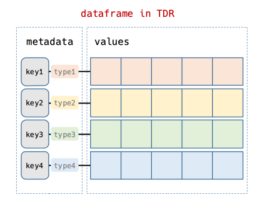
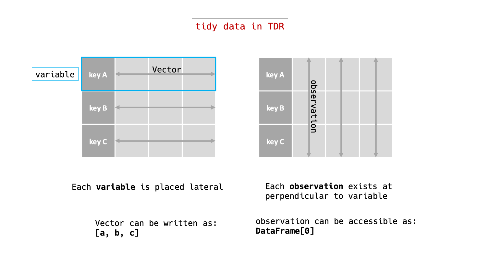

# TDR (Transposed DataFrame Representation)

([Japanese version](tdr_ja.md) of this document is available)

TDR is a presentation style of 2D data. It shows columnar vector values in *row Vector* and observations in *column* just like a **transposed** table.

 

Row-oriented data table (1) and columnar data table (2) have different data allocation in memory within a context of Arrow Columnar Format. But they have the same data placement (in rows and columns) in our brain.

TDR (3) is a logical concept of data placement to transpose rows and columns in a columnar table (2).

TDR is not an implementation in software but a logical image in our mind.

TDR is consistent with the 'transposed' tidy data concept. The only thing we should do is not to use the positional words 'row' and 'column'.

TDR is one of a simple way to create DataFrame object in many libraries. For example, we can initalize Arrow::Table in Red Arrow like the right below and get table as left.

We are using TDR style code naturally. For other example:
  - Ruby: Daru::DataFrame, Rover::DataFrame accept same arguments.
  - Python: similar style in Pandas for pd.DataFrame(data_in_dict)
  - R: similar style in tidyr for tibble(x = 1:3, y = c("A", "B", "C"))

There are other ways to initialize data frame, but they are not intuitive.

## Table and TDR API

The API based on TDR is draft and RedAmber is a small experiment to test the TDR concept. The following is a comparison of Table and TDR (draft).

|     |Basic Table|Transposed DataFrame|Comment for TDR|
|-----------|---------|------------|---|
|name in TDR|`Table`|`TDR`|**T**ransposed **D**ataFrame **R**epresentation|
|variable   |located in a column|a key and a `Vector` in lateral|select by keys|
|observation|located in a row|sliced in vertical|select by indices|
|number of variables|n_columns etc. |`n_keys`  |`n_cols` is available as an alias|
|number of observations|n_rows etc. |`size` |`n_rows` is available as an alias|
|shape      |[n_rows, n_columns]  |`shape`=`[size, n_keys]` |same order as Table|
|Select variables|select, filter, [ ], etc.|`pick` or `[keys]`  |accepts arguments or a block|
|Reject variables|drop, etc.|`drop`  |accepts arguments or a block|
|Select observations|slice, [ ], iloc, etc.|`slice` or `[indices]` |accepts arguments or a block|
|Reject observations|drop, etc.|`remove`  |accepts arguments or a block|
|Add variables|mutate, assign, etc.|`assign`  |accepts arguments or a block|
|update variables|transmute, [ ]=, etc.|`assign`  |accepts arguments or a block|
|inner join| inner_join(a,b) merge(a, b, how='inner')|`a.inner_join(b)` |with a option on:|
|left join| left_join(a,b) merge(a, b, how='left')|`a.join(b)` |naturally join from bottom with a option on:|
|right join| right_join(a,b)) merge(a, b, how='right')|`b.join(a)` |naturally join from bottom with a option on:|

## Operation example of TDR API

[Operation example of TDR API](image/TDR_operation.pdf) (draft)

## Q and A for TDR

（Not prepared yet)
